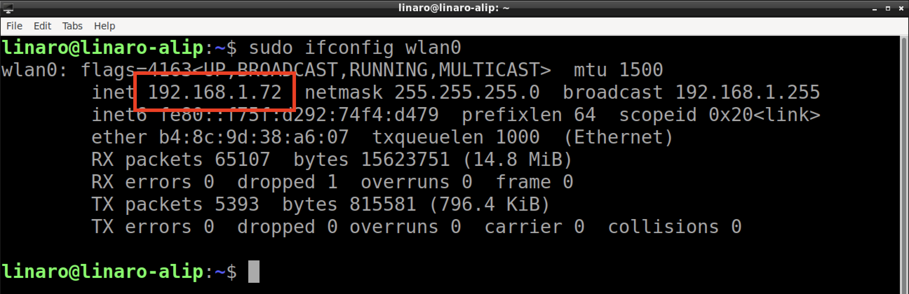
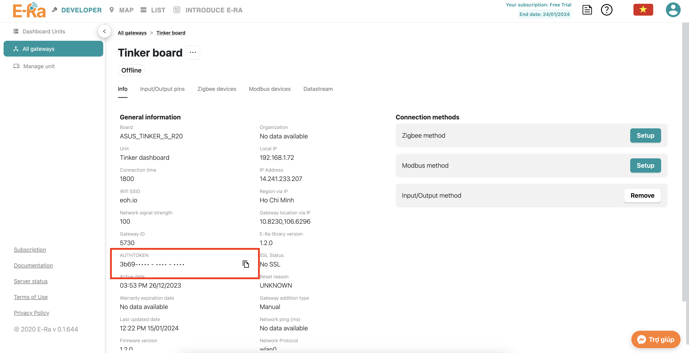

# Day 2: giám sát dữ liệu với Tinker board

1. Tìm địa chỉ ip và token Tinker board
2. Online Tinker thông qua ssh
3. Online Tinker với code mới

\----------------------------------------------------



**Tìm IP:** \
_Khởi động <mark style="color:orange;">**Tinker,**</mark> Mở <mark style="color:orange;">**LXTerminal**</mark> (<mark style="color:orange;">Start menu</mark> > <mark style="color:orange;">System Tools</mark> > <mark style="color:orange;">LXTerminal</mark>)_\
_<mark style="color:orange;">**Copy / paste lệnh**</mark>_

```
sudo ifconfig wlan0
```

<figure><figcaption></figcaption></figure>


**Tìm Token:**\
_Vào web_ [_**https://app.e-ra.io/dev-mode/gateways**_](https://app.e-ra.io/dev-mode/gateways) _>_ _<mark style="color:orange;">**Gateway của mình**</mark>_ _>_ _<mark style="color:orange;">**Copy authtoken**</mark>_

<figure><figcaption></figcaption></figure>



```
ssh linaro@<ip>
```

```
cd era-lib/linux
```

```
sudo ./era --token=<token> --host=mqtt1.eoh.io
```

* Mở <mark style="color:orange;">**Terminal**</mark> trên <mark style="color:orange;">**laptop**</mark>\
  **mac: **<mark style="color:orange;">**Cmd + Space**</mark> > <mark style="color:orange;">**gõ "terminal"**</mark> > <mark style="color:orange;">**enter**</mark>\
  **win: **<mark style="color:orange;">**Start menu**</mark> > <mark style="color:orange;">**gõ "cmd"**</mark> > <mark style="color:orange;">**enter**</mark>
* <mark style="color:orange;">**Copy / Paste**</mark> các <mark style="color:orange;">**lệnh trên**</mark>
* Thay <mark style="color:orange;">**ip**</mark> và <mark style="color:orange;">**token**</mark> tương ứng


_<mark style="color:orange;">**Ví dụ:**</mark>_

```
ssh linaro@<ip>
ssh linaro@192.168.1.2
```

```
sudo ./era --token=<token> --host=mqtt1.eoh.io
sudo ./era --token=111111-1111-1111-1111-11111111 --host=mqtt1.eoh.io
```



<mark style="color:orange;">**Offline**</mark>** Tinker:**

Thoát lệnh đang chạy với <mark style="color:orange;">**Ctrl + C**</mark>


<mark style="color:orange;">**Download**</mark>** và **<mark style="color:orange;">**Update**</mark>** code mới**

```
cd ~
git clone https://github.com/eoh-jsc/eoh-asus-training.git
cd eoh-asus-training

cp main.cpp ~/era-lib/linux
cp ERaConsole.h ~/era-lib/linux/User/inc
cp ERaConsole.cpp ~/era-lib/linux/User/inc
```


<mark style="color:orange;">**Build**</mark>** code mới**

```
cd ~/era-lib/linux
make clean all target=tinker
```


<mark style="color:orange;">**Online**</mark>** Tinker**

```
sudo ./era --token=<token> --host=mqtt1.eoh.io
```


