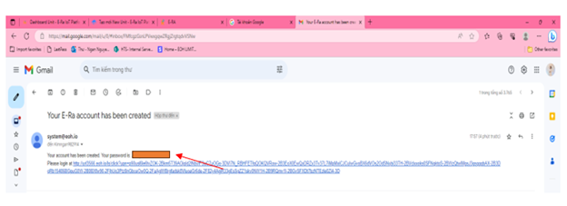
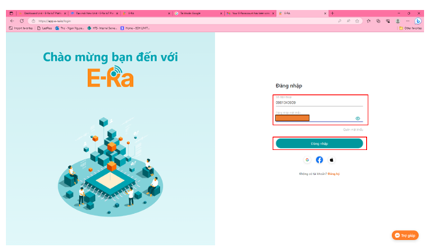
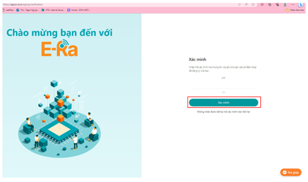
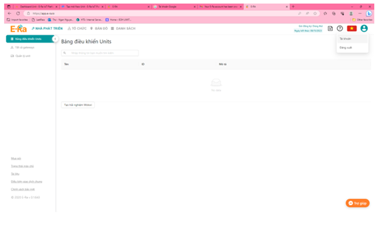

# Hướng dẫn sử dụng E-Ra (HSSV)

I/ HƯỚNG DẪN TRUY CẬP VÀO NỀN TẢNG E-RA ( TẤT CẢ USERS)

Website: Truy cập theo địa chỉ [https://app.e-ra.io](https://app.e-ra.io) (1)

Mobile: Download E-Ra app hoặc quét mã QR Code bên dưới (2).

<figure><figcaption>
(1)
</figcaption></figure>

<figure><figcaption>
(2)
</figcaption></figure>

II/ KÍCH HOẠT TÀI KHOẢN

_Bước 1_: Kiểm tra email đã đăng ký tài khoản

Mỗi tài khoản vừa kích hoạt sẽ nhận được 1 email từ E-Ra về đúng địa chỉ email đã đăng ký với Admin. Nội dung email bao gồm:

1/ Thông báo tài khoản vừa được kích hoạt

2/ Password tự động từ hệ thống

3/ Đường link đăng nhập vào Nền tảng E-Ra

_Bước 2_: Nhấn vào đường link đăng nhập đã đính kèm trong email hoặc [https://app.e-ra.io](https://app.e-ra.io) để đăng nhập

<figure><figcaption>
(Bước 1) và (Bước 2)
</figcaption></figure>

_Bước 3:_ Đăng nhập tài khoản (SĐT và Mật khẩu) à Nhấn nút “Đăng nhập’’à Hiển thị màn hình chính Darshboard.

<figure><figcaption>
(Bước 3)
</figcaption></figure>

_Bước 4:_ Xác minh tài khoản bằng cách nhập mã OTP qua sđt đã đăng ký

<figure><figcaption>
(Bước 4)
</figcaption></figure>

_Bước 5:_ Vào màn hình chính Dashboard

<figure><figcaption>
(Bước 5)
</figcaption></figure>
