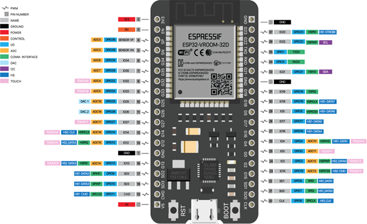

# Hướng dẫn cắm mạch ESP32



1.ESP32 modul

* Sơ đồ chân module ESP32 :

<figure><figcaption></figcaption></figure>

Lưu ý :&#x20;

&#x20;   \-Nguồn cấp: 5V hoặc dây Micro USB.&#x20;

Tham khảo thêm:&#x20;



2.Breakboard:&#x20;

&#x20; \- Cấu tạo Breakboard:&#x20;

<figure><figcaption></figcaption></figure>

\- Có thể dùng đồng hồ vạn năng để kiểm tra các chân trên Breakboard có nối với nhau hay không.&#x20;

&#x20;&#x20;

3.Lắp đặt Demo:

&#x20; \- Lưu ý chung :&#x20;

| Chức năng | Màu dây                     |
| --------- | --------------------------- |
| 3V3       | Màu đỏ                      |
| GND       | Màu đen                     |
| Tín hiệu  | Màu xanh dương, màu xanh lá |

&#x20;3.1.Bộ nút nhấn kèm đèn trạng thái:&#x20;

&#x20; 3.1.1.Cấu tạo nút ấn:&#x20;

<figure><figcaption></figcaption></figure>

&#x20; 3.1.2.Cách đấu nối nút ấn:&#x20;

&#x20; \- Linh kiện:&#x20;

&#x20;     \+ 1 led (G2-D2).&#x20;

&#x20;     \+ 1 Nút ấn (G0-D0).&#x20;

&#x20;     \+ 1 điện trở 330Ω, 1 điện trở 10KΩ.&#x20;

<figure><figcaption></figcaption></figure>

3.2.Đèn led (on/off/dimming):&#x20;

&#x20;   \- Linh kiện:&#x20;

&#x20;       \+ 1 điện trở 330Ω.&#x20;

&#x20;       \+ 1 led: SP-IO36-A0 (PWM).&#x20;

<figure><figcaption></figcaption></figure>

3.3.Biến trở:&#x20;

&#x20;   \- Linh kiện:&#x20;

&#x20;       \+ 1 điện trở 330Ω.&#x20;

&#x20;       \+ 1 led: G18-D18.&#x20;

&#x20;       \+ 1 biến trở 500KΩ: SN-IO39-A3.&#x20;

.png>)
