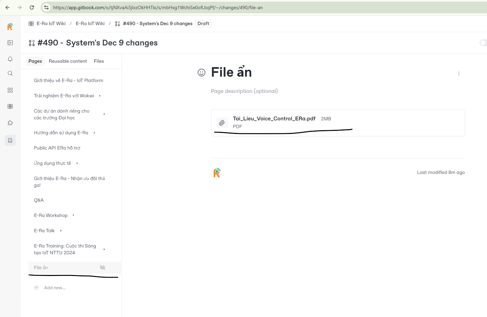

# Topic 3 - Xây dựng ngôi nhà thông minh với nền tảng E-Ra







### Đo nhiệt độ, độ ẩm



**Source code**

Đặt dưới `ERaTimer timer;`

```
#include <DHT20.h>
DHT20 dht;

void initDHT() {
    dht.begin();
}

void readDHT() {
    if (dht.isMeasuring()) {
        return;
    }
    if (dht.readData() < 0) {
        return;
    }
    if (dht.convert() == DHT20_OK) {
        ERa.virtualWrite(V0, dht.getHumidity());
        ERa.virtualWrite(V1, dht.getTemperature());
    }
    dht.requestData();
}

/* This function print uptime every second */
void timerEvent() {
    readDHT();
    ERA_LOG("Timer", "Uptime: %d", ERaMillis() / 1000UL);
}

void setup() {
    /* Setup debug console */
    Serial.begin(115200);

    /* Initialize */
    initDHT();

    /* Initializing the ERa library. */
    ERa.begin(ssid, pass);

    /* Setup timer called function every second */
    timer.setInterval(1000L, timerEvent);
}

void loop() {
    ERa.run();
    timer.run();
}
```


### Điều khiển, theo dõi thùng rác thông minh

 (1).png>)

 (1) (4).png>)

**Source code**&#x20;

Đặt trên `void setup()`

<pre><code><strong>// SRF
</strong>const uint8_t trigSRF = 26;
const uint8_t echoSRF = 18;

// Servo
const uint8_t pinServo = 15;
const uint8_t channelServo = 8;
const uint32_t freqServo = 50;
const uint8_t resolution = 16;

bool state = false;
int targetDegree = 90;
unsigned long distanceMax = 15;

// Init srf and servo
void initSRFAndServo() {
    // SRF
    pinMode(trigSRF, OUTPUT);
    pinMode(echoSRF, INPUT);

    // Servo  
    ledcSetup(channelServo, freqServo, resolution);
    ledcAttachPin(pinServo, channelServo);
    writeServo(0);
}

unsigned long getDistance() {
    unsigned long duration = 0;

    digitalWrite(trigSRF, LOW);
    delayMicroseconds(2);
    digitalWrite(trigSRF, HIGH);
    delayMicroseconds(10);
    digitalWrite(trigSRF, LOW);

    duration = pulseIn(echoSRF, HIGH, 10000UL);
    /* Speed of sound: 343.2 m/s -> 29.1375 us/cm */
    return uint32_t(duration / 2 / 29.1375f);
}

void writeServo(int degree) {
    int pulseUs = ERaMapNumberRange(degree, 0, 180, 500, 2500);
    int duty = ERaMapNumberRange(pulseUs, 0, 20000, 0, 65535);
    ledcWrite(channelServo, duty);
}

// Srf event
void srfEvent() {
    static bool prevState = false;
    unsigned long distance = getDistance();
    state = (distance &#x26;&#x26; (distance &#x3C;= distanceMax));
    if (state) {
        writeServo(targetDegree);
    }
    else {
        writeServo(0);
    }
    if (state == prevState) {
        return;
    }
    prevState = state;
    ERa.virtualWrite(V2, state);
}
</code></pre>


**Init**

Đặt trong `void setup()`

```
initSRFAndServo();
```


**Timer: read/send data**

Đặt trong `void setup()`

```
timer.setInterval(100L, srfEvent);
```



**Source code**

Đặt dưới `ERaTimer timer;`

```
#include <DHT20.h>
DHT20 dht;

void initDHT() {
    dht.begin();
}

void readDHT() {
    if (dht.isMeasuring()) {
        return;
    }
    if (dht.readData() < 0) {
        return;
    }
    if (dht.convert() == DHT20_OK) {
        ERa.virtualWrite(V0, dht.getHumidity());
        ERa.virtualWrite(V1, dht.getTemperature());
    }
    dht.requestData();
}

/* This function print uptime every second */
void timerEvent() {
    readDHT();
    ERA_LOG("Timer", "Uptime: %d", ERaMillis() / 1000UL);
}

// SRF
const uint8_t trigSRF = 26;
const uint8_t echoSRF = 18;

// Servo
const uint8_t pinServo = 15;
const uint8_t channelServo = 8;
const uint32_t freqServo = 50;
const uint8_t resolution = 16;

bool state = false;
int targetDegree = 90;
unsigned long distanceMax = 15;

// Init srf and servo
void initSRFAndServo() {
    // SRF
    pinMode(trigSRF, OUTPUT);
    pinMode(echoSRF, INPUT);

    // Servo  
    ledcSetup(channelServo, freqServo, resolution);
    ledcAttachPin(pinServo, channelServo);
    writeServo(0);
}

unsigned long getDistance() {
    unsigned long duration = 0;

    digitalWrite(trigSRF, LOW);
    delayMicroseconds(2);
    digitalWrite(trigSRF, HIGH);
    delayMicroseconds(10);
    digitalWrite(trigSRF, LOW);

    duration = pulseIn(echoSRF, HIGH, 10000UL);
    /* Speed of sound: 343.2 m/s -> 29.1375 us/cm */
    return uint32_t(duration / 2 / 29.1375f);
}

void writeServo(int degree) {
    int pulseUs = ERaMapNumberRange(degree, 0, 180, 500, 2500);
    int duty = ERaMapNumberRange(pulseUs, 0, 20000, 0, 65535);
    ledcWrite(channelServo, duty);
}

// Srf event
void srfEvent() {
    static bool prevState = false;
    unsigned long distance = getDistance();
    state = (distance && (distance <= distanceMax));
    if (state) {
        writeServo(targetDegree);
    }
    else {
        writeServo(0);
    }
    if (state == prevState) {
        return;
    }
    prevState = state;
    ERa.virtualWrite(V2, state);
}

void setup() {
    /* Setup debug console */
    Serial.begin(115200);

    /* Initialize */
    initDHT();
    initSRFAndServo();

    /* Initializing the ERa library. */
    ERa.begin(ssid, pass);

    /* Setup timer called function every second */
    timer.setInterval(1000L, timerEvent);
    timer.setInterval(100L, srfEvent);
}

void loop() {
    ERa.run();
    timer.run();
}
```



## Tài liệu Thuyết trình


Tài liệu E-Ra Workshop - Topic 3


## Video E-Ra Workshop






