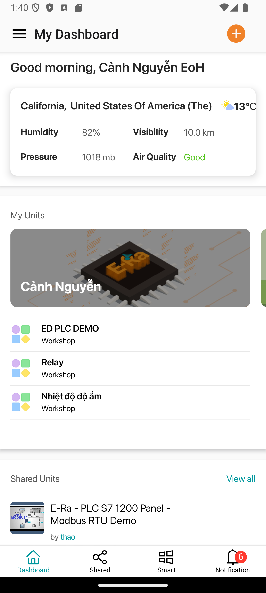
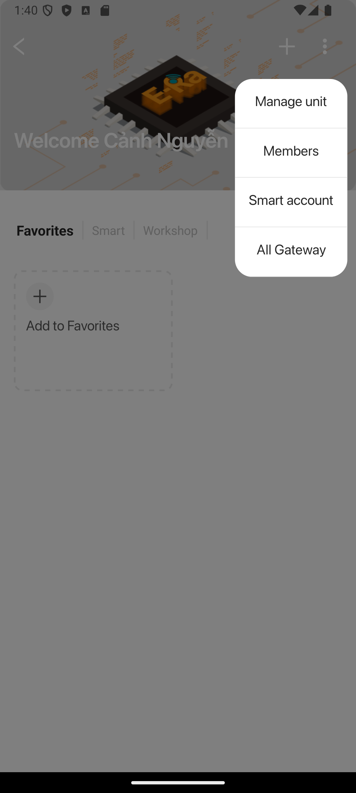

# Hướng dẫn xem danh sách thành viên trong Unit

**Bước 1:** Mở ứng dụng EoH, tại giao diện chính, chọn Unit của bạn.

<figure><figcaption></figcaption></figure>

**Bước 2:** Nhấn vào biểu tượng **3 chấm** ở góc phải màn hình, sau đó chọn **Members**.

<figure><figcaption></figcaption></figure>

**Bước 3:** Màn hình sẽ hiển thị danh sách thành viên trong Unit. Bạn có thể nhấn vào từng thành viên để xem thông tin chi tiết, bao gồm các thiết bị được phân quyền cho thành viên đó.

<figure><figcaption></figcaption></figure>

